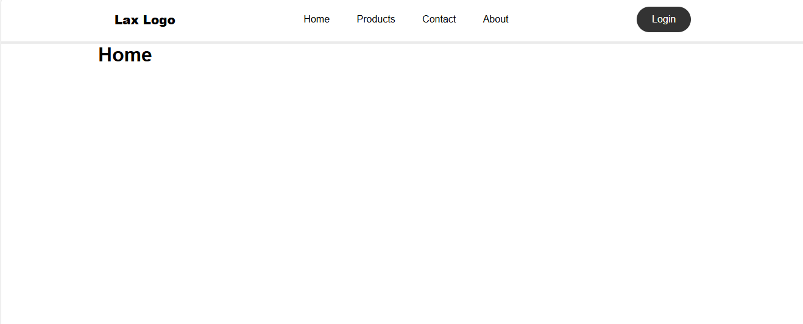
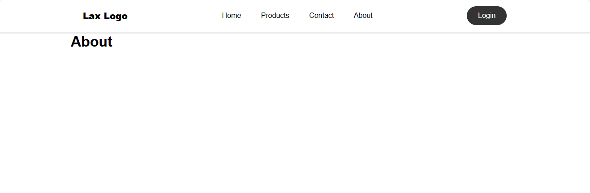
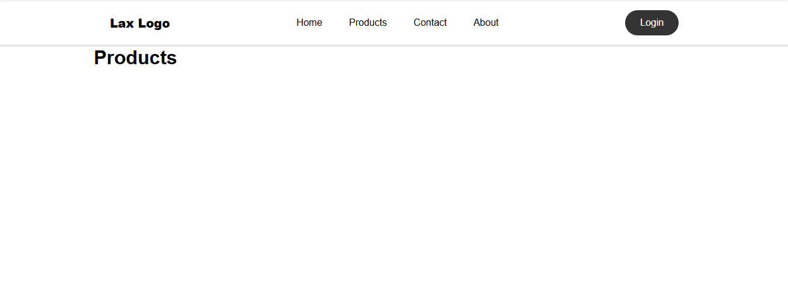
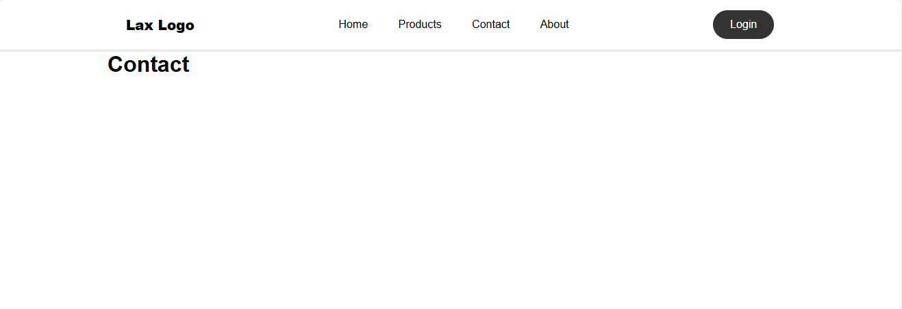

# React Router Demo App

## Overview
This project is a basic React application that demonstrates the implementation of routing using `react-router-dom`. It includes a navigation bar and multiple pages such as Home, About, Products, and Contact.

## Features
- **Routing**: Navigation between different pages using `react-router-dom`.
- **Responsive Navbar**: A simple, responsive navigation bar with links to various pages.
- **Component Structure**: Organized into separate reusable components for better maintainability.

## Installation
1. Clone the repository:
   ```bash
   git clone https://github.com/Laxshan19/React-Router-Demo-App.git


## Screenshots
### Navbar


### Home Page


### About Page


### Products Page


### Contact Page

